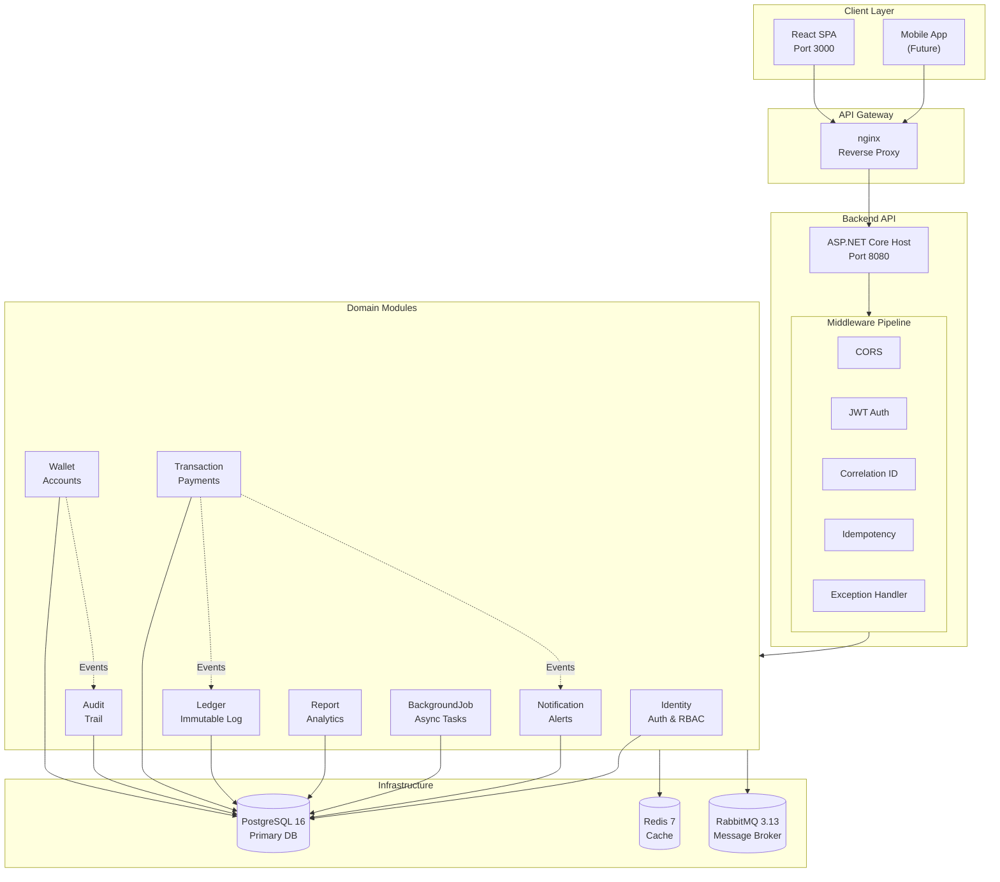
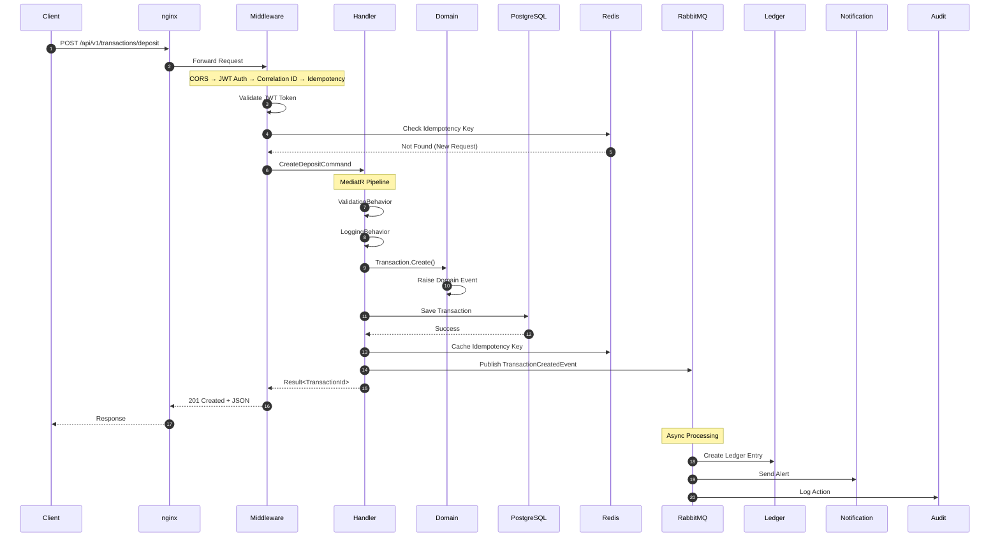
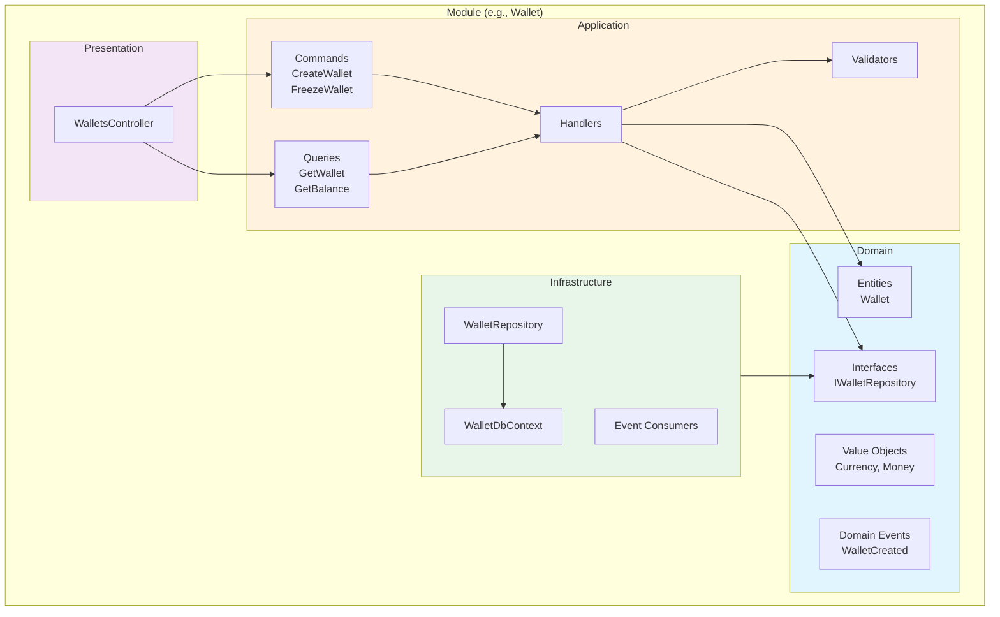
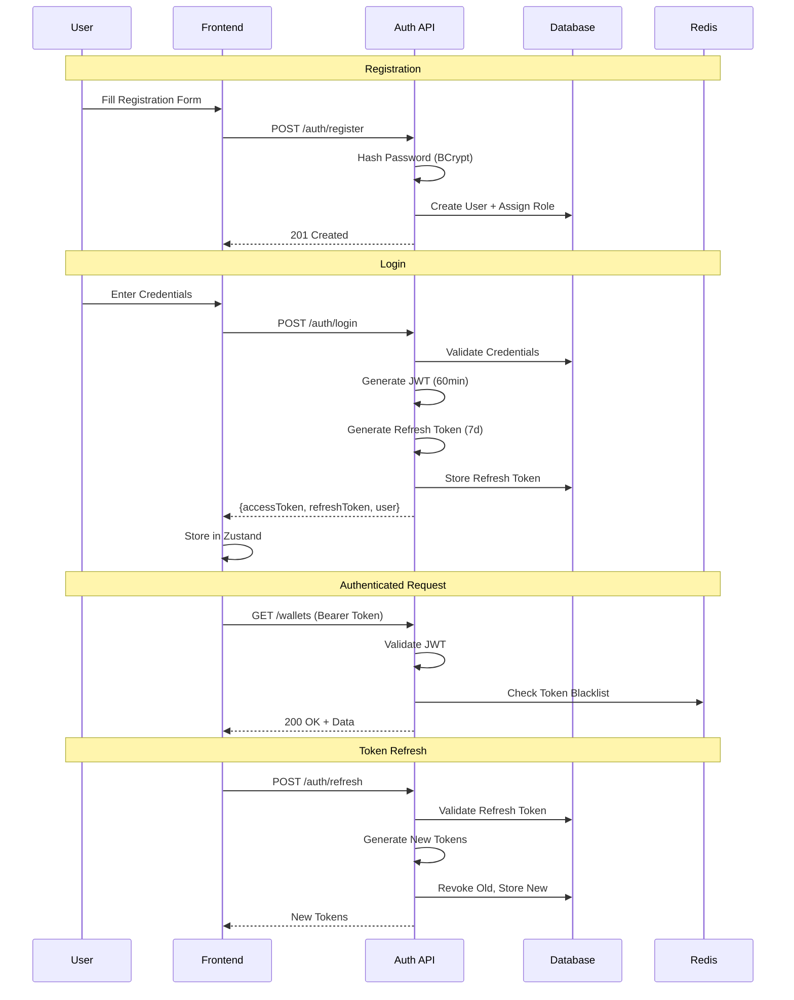
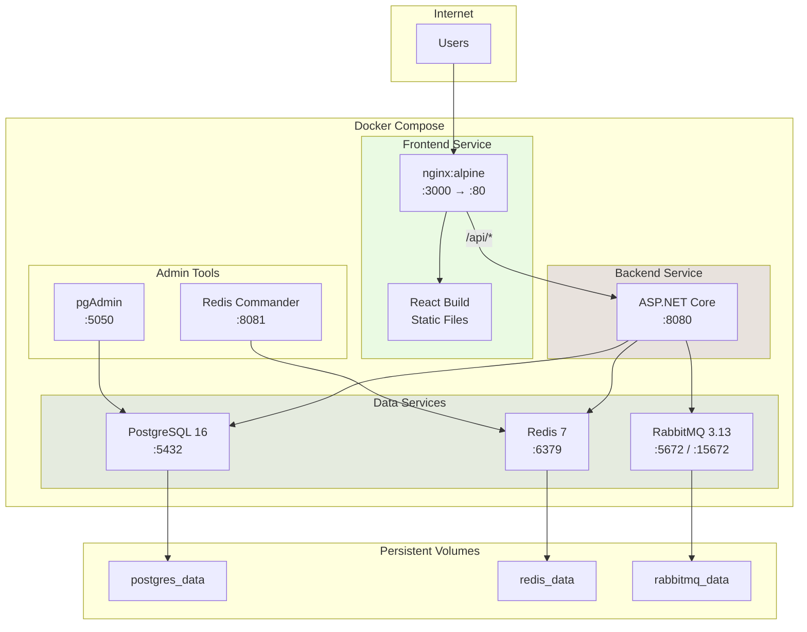
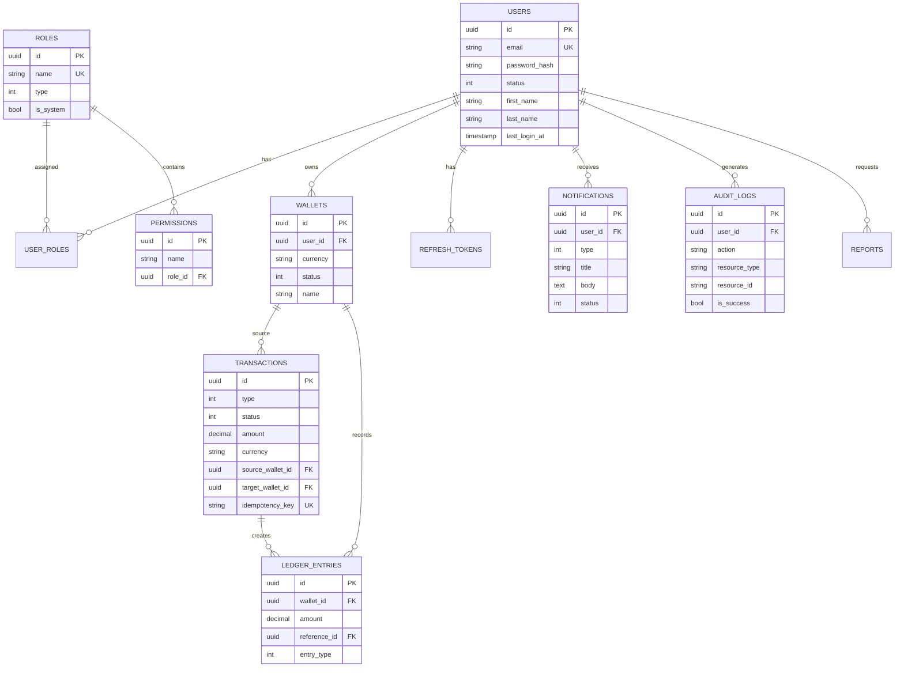

# FinTech Modular Platform

A production-ready fintech platform built with .NET 9 and React 19, following Domain-Driven Design (DDD), Clean Architecture, and modular monolith patterns.

[](https://dotnet.microsoft.com/)
[](https://react.dev/)
[](https://postgresql.org/)
[](https://docker.com/)
[](LICENSE)

---

## Architecture Overview



---

## Request Flow



---

## Module Architecture

Each module follows Clean Architecture with 4 layers:



---

## Authentication Flow



---

## Deployment Architecture



---

## Database Schema



---

## Tech Stack

| Layer | Technology | Purpose |
|-------|------------|---------|
| **Frontend** | React 19, TypeScript 5.9, Vite 8 | SPA Framework |
| | MUI 7, Zustand, TanStack Query | UI, State, Data Fetching |
| **Backend** | .NET 9, ASP.NET Core | API Framework |
| | MediatR, FluentValidation | CQRS, Validation |
| | MassTransit | Message Bus |
| | EF Core 9 | ORM |
| **Database** | PostgreSQL 16 | Primary Storage |
| | Redis 7 | Caching, Idempotency |
| | RabbitMQ 3.13 | Event Messaging |
| **Infrastructure** | Docker Compose | Container Orchestration |
| | nginx | Reverse Proxy |

---

## Quick Start

### Prerequisites

- Docker Desktop 4.x
- .NET SDK 9.0
- Node.js 22.x
- Git

### 1. Clone & Start Infrastructure

```bash
git clone <repository-url>
cd fintech-modular-platform

cd infrastructure/docker
docker compose up -d
```

### 2. Run Backend

```bash
cd src/Backend/Host/FinTech.Api
dotnet run
```

Backend available at: http://localhost:5152/swagger

### 3. Run Frontend

```bash
cd src/Frontend
npm install
npm run dev
```

Frontend available at: http://localhost:3000

### 4. (Alternative) Full Docker Stack

```bash
cd infrastructure/docker
docker compose --profile app up -d --build
```

---

## Project Structure

```
fintech-modular-platform/
├── docs/                             # Developer documentation
├── infrastructure/
│   └── docker/                       # Docker Compose + init scripts
├── src/
│   ├── Backend/
│   │   ├── Host/FinTech.Api/         # ASP.NET Core host
│   │   ├── Modules/                  # Domain modules (8)
│   │   │   ├── Identity/
│   │   │   ├── Wallet/
│   │   │   ├── Transaction/
│   │   │   ├── Ledger/
│   │   │   ├── Notification/
│   │   │   ├── Audit/
│   │   │   ├── Report/
│   │   │   └── BackgroundJob/
│   │   └── Shared/                   # Shared kernel + infrastructure
│   └── Frontend/                     # React SPA
└── tests/                            # Unit, Integration, Architecture tests
```

---

## Documentation

| Guide | Description |
|-------|-------------|
| [Getting Started](docs/getting-started.md) | Setup & first API calls |
| [Architecture](docs/architecture.md) | Design decisions & patterns |
| [API Reference](docs/api-reference.md) | All endpoints & contracts |
| [Development Guide](docs/development-guide.md) | Adding features & coding standards |
| [Frontend Guide](docs/frontend-guide.md) | React patterns & design system |
| [Deployment](docs/deployment.md) | Docker & production setup |
| [Database](docs/database.md) | Schema reference & queries |

---

## API Endpoints

| Module | Endpoint | Description |
|--------|----------|-------------|
| Auth | `POST /api/v1/auth/register` | Create account |
| Auth | `POST /api/v1/auth/login` | Get JWT tokens |
| Auth | `POST /api/v1/auth/refresh` | Refresh tokens |
| Wallets | `POST /api/v1/wallets` | Create wallet |
| Wallets | `GET /api/v1/wallets/{id}` | Get wallet |
| Transactions | `POST /api/v1/transactions/deposit` | Deposit funds |
| Transactions | `POST /api/v1/transactions/withdraw` | Withdraw funds |
| Transactions | `POST /api/v1/transactions/transfer` | Transfer between wallets |
| Ledger | `GET /api/v1/ledger/entries` | Get ledger entries |
| Reports | `POST /api/v1/reports/generate` | Generate report |

See [API Reference](docs/api-reference.md) for complete documentation.

---

## Testing

```bash
# Run all tests
dotnet test

# Run specific test project
dotnet test tests/Backend/Unit/FinTech.Tests.Unit/

# Frontend type check
cd src/Frontend && npm run build
```

---

## License

This project is licensed under the MIT License - see the [LICENSE](LICENSE) file for details.

---

<p align="center">
  Built with .NET 9 + React 19
</p>
